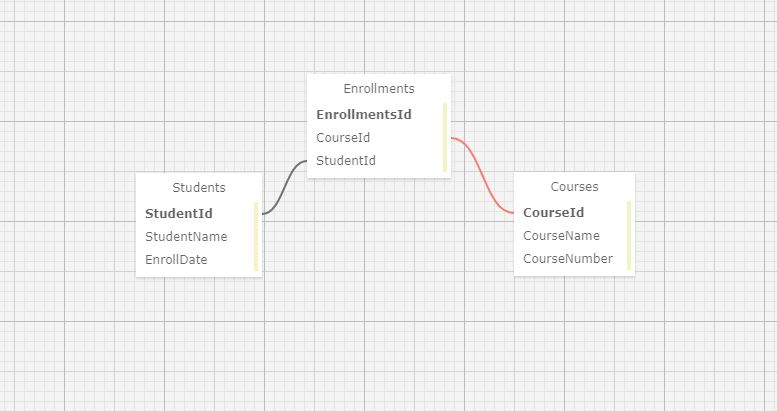

# International University of TacoBell's Registrawr

#### Many-to-many MVC project

#### by Taylor Delph, Ellie Lambert, Shannon Grantski, Zahnen Garner

## **Description**

Create an app for a University registrar to keep track of students and courses.

---  

## User Stories and Specs

<details>
  <summary>Click for User Stories yada yada</summary>   <!-- this makes it collapsable -->
  
  <table>
  <tr>
    <th>Scenario 01</th>
    <th></th>
  </tr>
  <tr>
    <td>Behavior</td>
    <td>As a registrar, I want to enter a student, so I can keep track of all students enrolled at this University.</td>
  </tr>
  <tr>
    <td>Input</td>
    <td>Student name and date of enrollment</td>
  </tr>
  <tr>
    <td>Output</td>
    <td>Return list of all students enrolled</td>
  </tr>
  <tr>
    <td>Completion</td>
    <td>True</td>
  </tr>
</table>

<table>
  <tr>
    <th>Scenario 02</th>
    <th></th>
  </tr>
  <tr>
    <td>Behavior</td>
    <td>As a registrar, I want to enter a course, so I can keep track of all of the courses the University offers.</td>
  </tr>
  <tr>
    <td>Input</td>
    <td>Course name and course number.</td>
  </tr>
  <tr>
    <td>Output</td>
    <td>Return list of all courses.</td>
  </tr>
  <tr>
    <td>Completion</td>
    <td>True</td>
  </tr>
</table>

<table>
  <tr>
    <th>Scenario 03</th>
    <th></th>
  </tr>
  <tr>
    <td>Behavior</td>
    <td>As a registrar, I want to be able to assign students to a course, so that teachers know which students are in their course.</td>
  </tr>
  <tr>
    <td>Input</td>
    <td>Enroll student in course</td>
  </tr>
  <tr>
    <td>Output</td>
    <td>Return list of all courses student is enrolled in.</td>
  </tr>
  <tr>
    <td>Completion</td>
    <td>True</td>
  </tr>
</table>

</details>

---  

## Schema



---  

## Setup and Use

* _Open your git-capable command line program (we recommend Terminal on Mac or Git Bash on PC)_
* _Ensure you are within the directory you'd like the file to be created in._
* _Enter the command "$ git clone https://github.com/taylulz/Registrar.Solution" in your command line_
* _Once cloned, use the "$ cd " command to navigate to the directory created in the previous step._
* _You must have .NET Core V2.2 installed in order to run the console app successfully. If you do not have .NET Core V2.2 installed, find more information and download it [here](https://dotnet.microsoft.com/download/dotnet-core/2.2)_
* _To run the console application, enter "dotnet run" in your command line while in the Registrar directory._
* _Your command line will open a server (likely "http://localhost:5000/"). Navigate to this URL in your browser to view the project._

## App Settings

```
{
  "ConnectionStrings": {
      "DefaultConnection": "Server=localhost;Port=3306;database=registrar;uid=root;pwd=epicodus;"
  }
} 
```

---  

## Known Bugs/Issues

There are no known bugs or issues at this time. If you come across any, please let me know by emailing us!


---  


## Support and Contact Details

* Zahnen Garner // zahnen@gmail.com
* Taylor Delph // taylulzcode@gmail.com
* Shannon Grantski // grantski@pm.me
* Ellie Lambert // ebezjian@gmail.com

---  

## Technologies Used

_This application required use of the following programs/languages/libraries to create:_
* _GitBash_
* _Visual Studio Code_
* _GitHub_
* _GitHub Pages_
* _C# v 7.3_
* _.NET Core v 2.2_
* _MSTest_
* _ASP.NET Core MVC_
* _Bootstrap_
* _CSS_
* _cshtml_
* _MySQL Workbench_
* _Entity Framework Core_
* _[SQL Designer](https://ondras.zarovi.cz/sql/demo/)_

---  

## License

*Licensed under MIT* 